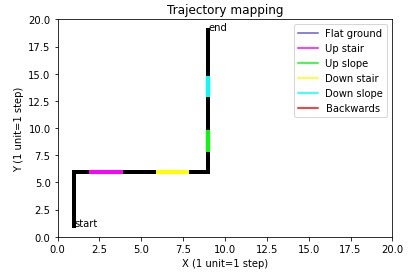
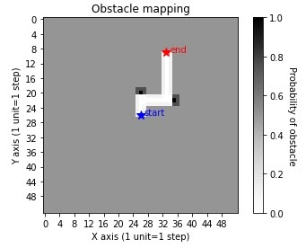
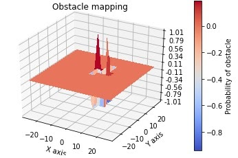

# Applications

### 1. Mapping
[Trajectory mapping](mapping1.py)

  

[Obstacle mapping](mapping2.py)

  
  

### 2. [Object detection](object_detection.py)

Source: [Tensorflow detection model zoo](https://github.com/tensorflow/models/blob/master/research/object_detection/object_detection_tutorial.ipynb), [Tensorflow detection using Raspberry Pi](https://github.com/EdjeElectronics/TensorFlow-Object-Detection-on-the-Raspberry-Pi/blob/master/Object_detection_picamera.py)

### 3. Facial recognition

[Encoding faces](encode_faces.py)
[Facial recognition](pi-face-recognition.py)
Source: [Raspberry pi facial recognition](https://www.pyimagesearch.com/2018/06/25/raspberry-pi-face-recognition/)