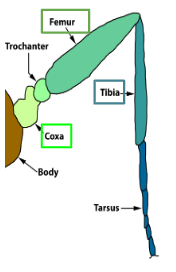
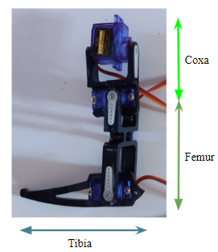

# Design

## Configuration
Sprawling-type configuration was chosen as it has the following advantages over mammal-type configuration-
1. It has higher stability. This can be attributed to its low position of centre of gravity and its wider supporting leg polygon[1].
2. It also has a wider range of motion due to its horizontal structure[1,22].
3. Since the body of the robot is at a lower position, damage to the robot is minimal in case it falls[1].

## Structure
Several studies have been conducted to approach the system of vertebrate legged animals from a kinematic point of view. Bones and articulations can easily be modelled as links and joints. Links are the rigid parts of the body. Joints allow controlled or free relative motion of the links.
An arthropod leg, as shown below was chosen as the structure for the robot’s legs to be modelled on.

  

The mechanism derived from an arthropod leg is based on three parts of the leg, namely coxa, femur and tibia. Simplification of this mechanism and application to a robot’s legs results in 3-DOF(roll, pitch, yaw) legs[22], as shown below.

  

The robot was assembled by connecting the 3D printed parts using the SG90 servo motors and fixing them with screws and hot glue.
