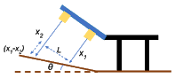
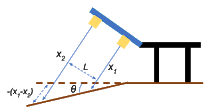

# Locomotion

## Generation of gaits
Gait is a cyclic pattern of movement or a sequence of steps that the robot adopts for
locomotion.Three gaits were implemented- creep gait, trot gait and bound gait.

### 1. [Creep gait](creep_gait.py)

  

### 2. [Trot gait](trot_gait.py)

  

### 3. [Bound gait](bound_gait.py)

  

## [Classification of terrain](classification.py)
A single approach was adopted to classify all
possible terrains, i.e., flat ground, upward step, downward step, upward slope and
downward slope.

The classification sensor block consists of two ultrasonic sensors. They are placed one
below the other on a platform which is at a height from the robot and angled towards the
ground. Thus, the sensor data gives the distance from the platform to the ground. Based
on this data, the terrain can be classified. This approach also allows the robot to calculate
the height of the stair and the angle of the slope.

Notations used in the figure are listed in the table below.
|U1, U2|Ultrasonic sensor 1 and 2 respectively|
|X1o, X2o|Calibrated distances of U1 and U2 on flat ground|
|max1|Maximum reading of the 20 readings taken during calibration of U1|
|min1|Minimum reading of the 20 readings taken during calibration of U1|
|max2|Maximum reading of the 20 readings taken during calibration of U2|
|min2|Minimum reading of the 20 readings taken during calibration of U2|
|x1, x2|Measured distances of U1 and U2|
|X1T, X2T|Threshold of U1 and U2|
|α|Incident angle made by the rays from the sensors, with respect to the flat ground|
|90-α|Angle at which the sensors are placed|
|L|Distance between U1 and U2a|

### [Calibration](calibration.py)
First, the sensors are calibrated on flat ground by taking an average of twenty readings to get calibrated distances X1o and X2o. Ideally, this distance should remain the same for all flat ground readings, i.e., the measured distances x1 and x2 are equal to X1o and X2o. Practically, noises in the environment should be considered, hence thresholds X1T and X2T are set for sensors U1 and U2 respectively, as follows-
X1T = maximum of ((max1 - X1o), (X1o – min1))
X2T = maximum of ((max2 - X2o), (X2o – min2))

  

### Flat ground
|x1-X1o| ≤ X1T, |x2-X2o| ≤ X2T

  
  <width="200">
  <height="100">

### Upstep
(X1o-x1) ≥ X1T, (X2o-x2) ≥ X2T
and (X1o-x1) ≈ (X2o-x2) 

  

### Downstep
(x1-X1o) > X1T, (x2-X2o) > X2T
and (x1-X1o) ≈ (x2-X2o)

  

### Height of step
h= (X1o-x2)sinα= (X2o-x2)sinα

  

### Upslope
(X1o-x1) ≥ X1T, (X2o-x2) ≥ X2T
and (X1o-x1) < (X2o-x2)

  

### Downslope
(x1-X1o) > X1T, (x2-X2o) > X2T
and (x1-X1o) < (x2-X2o)

  

### Angle of slope
Θ=pi/2-α-arctan((x1-x2)/L)

  

