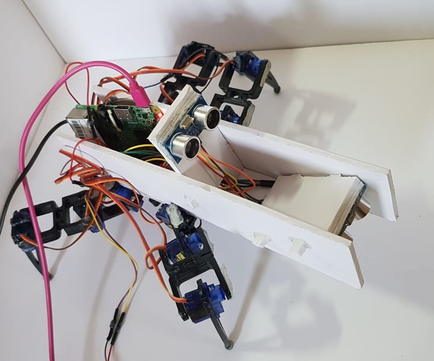

# Multi-Terrain Quadruped
Final year thesis @ PES University, India

  

#### This thesis revolves around the design, locomotion and application of an autonomous quadruped that can operate on irregular terrain, i.e., slopes and steps, and implement obstacle avoidance.

:mechanical_leg: The [design](/Design) aspect consists of mechanical configuration, structure and construction, and
mechanical and electronic layout.

:mechanical_leg: The [locomotion](/Locomotion) aspect consists of four-legged coordination and a framework for motion
planning over varied terrain, which includes classification of different terrain and obstacle
avoidance.

:mechanical_leg: The [application](/Application) aspect consists of an exploration of different test-cases of the quadruped
in real-life scenarios.
